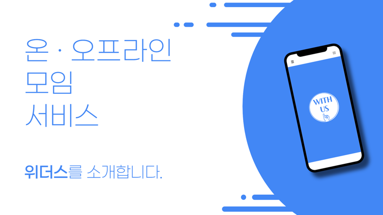

<!--

-->

위더스(With US)는 약속에 신뢰를 보장해주면서 사용자에게 다양한 분야에서 온·오프라인 모임을 간편할 수 있도록 도와주는 서비스입니다.

  

<!--
<h2 align="center">서비스 특징</h2>

* 위더스(With US) 서비스를 통해 개인으로 활동하기에는 비용이나 낭비를 비롯해 부담되는 일을 같이 할 사람을 모집할 수 있습니다.
* 단체로서 이득을 취할 수 있는 분야에 대해 손쉽게 단체를 구성할 수 있게 됩니다.
* 장기적인 모임뿐만 아니라 간단한 일회성 모임을 구성할 수 있습니다.
* 당일 모임이 신속히 이루어질 수 있도록 일정 거리 이내 범위 제한 기능과 모임 약속 보장을 위한 신뢰 점수제를 도입하여 사용자들간의 약속에 안정감을 받을 수 있습니다.
* 약속 주최자와 1대1 채팅을 통해 문의나 조정도 빠르게 가능합니다.
* 간단한 절차로 시작해 믿음이 가는 일회성 모임부터 장기적인 모임까지 어느 어떤 분야에서든 손쉽게 접근할 수 있습니다.
  
-->

<h2 align="center"><strong>서비스 흐름도</strong></h2>

1. **사용자 입력** 
    모집할 사용자가 약속 카테고리, 시간, 날짜 및 시간, 모집 인원, 추가 정보를 입력하여 약속 생성  
2. **모집 공고** 
    인증한 지역 정보를 이용하여 반경 3km 이내의 사용자들을 모집  
3. **채팅 및 평가** 
    채팅으로 자세한 장소와 시간 등을 상의하고, 모임이 종료되면 해당 약속에 참여한 나머지 인원을 평가  
4. **점수 변환** 
    약속 종료 후, 평가 점수를 반영하여 신뢰도 점수를 올리거나 낮추어 사용자의 레벨 결정